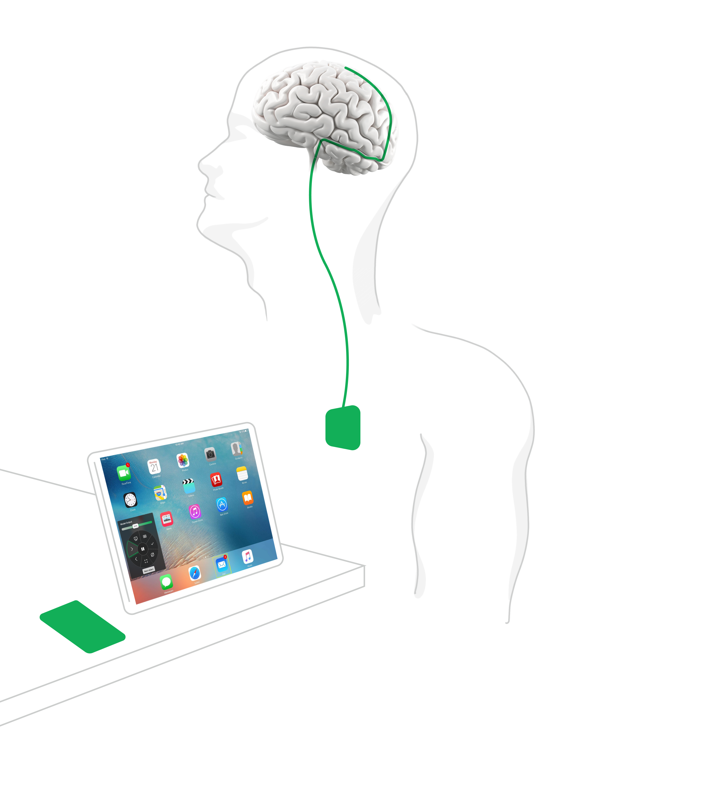
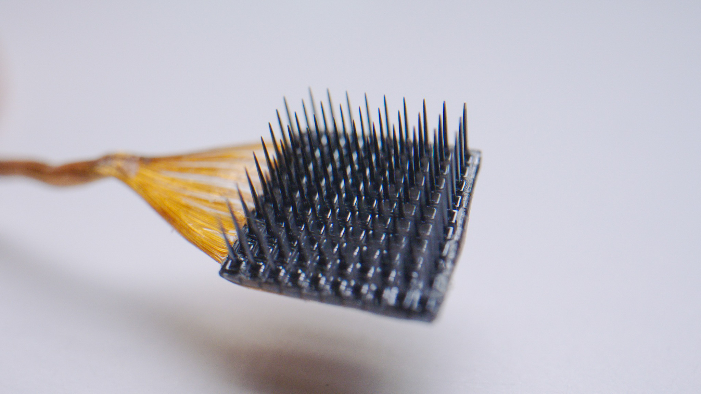
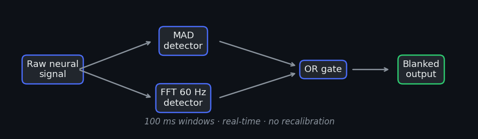
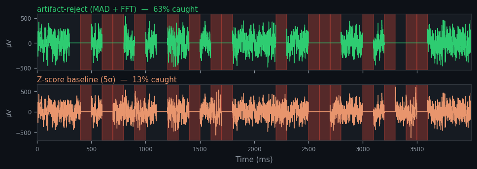

<!-- _class: title -->

# artifact-reject

real-time artifact rejection for brain-computer interfaces

**James Mu (Duke)** and **Derek Mu (CMU)**
*HackDuke 2026*

---

# The problem

BCIs decode brain signals into commands — but artifacts corrupt the signal and cause wrong outputs.

> For a patient controlling a prosthetic, that failure matters.

---

# The gap

Z-score thresholding **misses 87% of artifacts.**

No standard solution exists across labs or devices.

---

# Our approach

- **MAD** — adaptive amplitude threshold, no recalibration
- **FFT** — catches 60 Hz line noise z-score misses

---

# Results

| | artifact-reject | Baseline |
|--|--|--|
| Artifacts detected | **63%** | 13% |

**5× more caught.** Drop-in for Science Corp's Synapse.

---

<!-- _class: title -->

# Live demo

BCI keyboard — with and without our filter.

---

<!-- _class: title -->

# Thank You

James Mu (Duke) · Derek Mu (CMU)

`github.com/jamesmu03/artifact-reject`

*HackDuke 2026*
